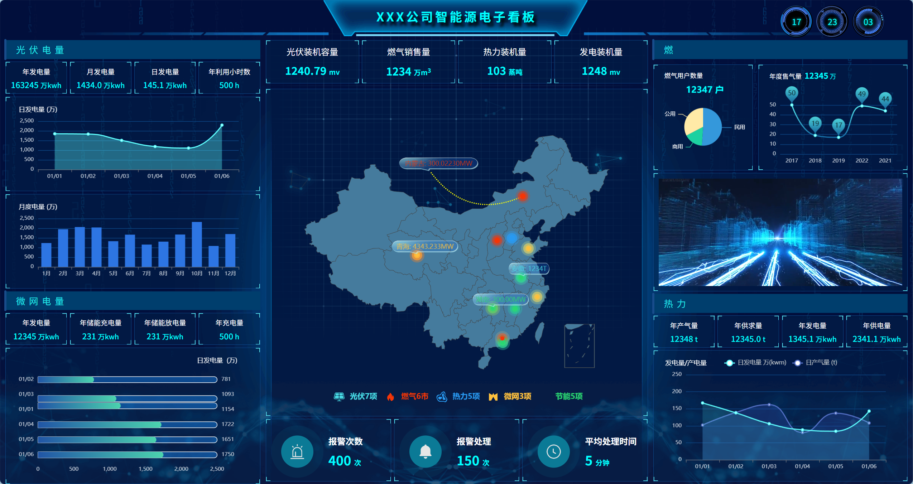

# Visualization_min（能源大屏）

一个基于 **HTML + CSS Grid + JavaScript + ECharts** 的静态数据可视化大屏示例，包含光伏/微网/燃气/热力等指标卡片、趋势图、排序条形图、中国地图散点与飞线、告警动效与视频区域等模块。如图所示：



## 功能概览

- **顶部标题与时钟**：标题文案 + 时分秒数字显示 + 表盘旋转效果（`js/settimer.js`）。
- **光伏电量（模块 1）**：
  - 指标卡片（年/月/日发电量、年利用小时数）自动递增模拟（`js/settimer.js`）。
  - 折线面积图（近几日）定时滚动更新（`js/index.js` 的 `init1`）。
  - 月度柱状图随机数据展示（`js/index.js` 的 `init1`）。
- **微网电量（模块 2）**：横向条形图 + “冒泡排序”式动态排序演示（`js/index.js` 的 `init2`）。
- **综合指标（模块 3）**：装机容量/销售量等指标随机跳动模拟（`js/settimer.js`）。
- **地图（模块 4）**：中国地图（`js/china_all.js` 注册 `china` 地图）+ 多组 `effectScatter` + 飞线 `lines` + 气泡 `scatter`（`js/index.js` 的 `init4`）。
- **告警（模块 5）**：三组涟漪散点 + 图标 markPoint（报警/铃声/时钟），并配合指标递增（`js/index.js` 的 `init5` + `js/settimer.js`）。
- **燃气（模块 6）**：用户结构饼图（定时增量）+ 年度售气量折线/散点高亮轮播 + 视频展示区域（`js/index.js` 的 `init6`）。
- **热力（模块 7）**：双折线趋势图定时滚动（`js/index.js` 的 `init7`）+ 指标递增（`js/settimer.js`）。

> 说明：当前数据主要为 **随机数/定时器模拟**，便于演示动效与布局；接入真实接口时可替换为 Ajax/Fetch/WebSocket 等数据源。

## 技术栈

- **页面**：原生 HTML
- **样式**：CSS（使用 Grid 做整体布局，见 `css/index.css`）
- **图表**：[Apache ECharts 5](https://echarts.apache.org/)（默认通过 CDN 引入）
- **地图数据**：`js/china_all.js`（注册 `china` 地图）

## 目录结构

```text
Visualization_min/
├─ index.html              # 入口页面
├─ favicon.ico
├─ css/
│  └─ index.css            # 大屏整体布局与主题样式
├─ js/
│  ├─ index.js             # ECharts 初始化（1/2/4/5/6/7 模块）
│  ├─ settimer.js          # 顶部时间与各指标定时刷新
│  ├─ utils.js             # getRandom / getNow / $ 等工具函数
│  ├─ city_data.js         # 地图散点随机数据池
│  ├─ china_all.js         # 中国地图 geojson + registerMap('china')
│  └─ echarts.min.js       # 本地 ECharts（可选）
└─ image/                  # 背景与图标资源（气泡、图例 icon 等）
```

## 本地运行

这是静态项目，无需安装依赖。

- **方式 A（最简单）**：直接用浏览器打开 `index.html`
  - 可能会遇到某些浏览器对本地文件的资源/跨域限制（尤其是地图/媒体/字体等），推荐使用方式 B。
- **方式 B（推荐）**：用任意静态服务器启动
  - VSCode 安装并使用 Live Server 插件，右键 `index.html` → Open with Live Server
  - 或使用你习惯的静态服务器（nginx、http-server、python `http.server` 等）

## 可配置项（常用改动点）

- **标题文案**：`index.html` 中的 `XXX公司智能源电子看板`
- **ECharts 引入方式**：`index.html` 目前使用 CDN：
  - `https://cdn.jsdelivr.net/npm/echarts@5.4.3/dist/echarts.min.js`
  - 如需离线：取消注释本地 `./js/echarts.min.js` 引入并移除 CDN（见 `index.html` 底部 script 区域）。
- **地图散点/气泡数据**：
  - 城市经纬度池：`js/city_data.js`
  - 地图图层配置：`js/index.js` 的 `init4()`
- **视频地址**：`index.html` 中 `<video src="...">` 可替换为你的资源链接或本地文件（注意浏览器对自动播放的策略，页面已设置 `muted`）。

## 部署

将整个目录作为静态站点发布即可（保持目录结构不变），入口为 `index.html`。

## 免责声明

本项目为可视化大屏演示模板，默认数据为模拟生成；商用/生产环境请自行接入真实数据、补齐权限与安全策略，并确认第三方资源（CDN、视频链接等）可用性与合规性。

